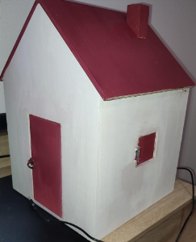
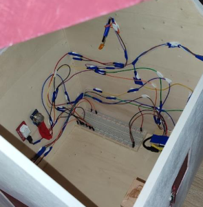

+++
title = 'Home automation Model - Domotech'
date = 2022-04-15
description = 'An home automation system powered by an ESP32 and controled with a website.'
status = 'published'

[extra]
toc = true
+++

# Domotech - The home automation system

Here is the [Github Repository](https://github.com/Tsukoyachi/Domotech) of this project.

## Project Overview

The main purpose of this project was to develop knowledge about on-board electronics.  
 
This project implement a detection of some variable like the temperature, the luminosity and the air quality through some sensor.
Because I didn't have access to all the material needed, with these data I add access to two main action, open/close a window and control two led, one to represent the heater and one for the real light.  
 
Because the action were limited and because some action were triggered by multiple situation, I had to create a algorithm that take every situation into account before doing an action.  
 
And last but not least, I wanted to let the user be able to take controle of everything whenever he want to I created a website that allow the user to directly interfer with the actual algorithm in order to bypass it.  
 
For the model it's made from painted wood. Here are some photo of it :  
 
    <table style = "margin:auto">
        <tr>
            <td></td>
            <td></td>
        </tr>
    </table>
 
You also have access to a live demo [here](https://www.youtube.com/watch?v=h6xsl7u4DOc&list=PLZiidj2X6S_mYPlfseCMSw44s1h56aiDF&index=2)  
 